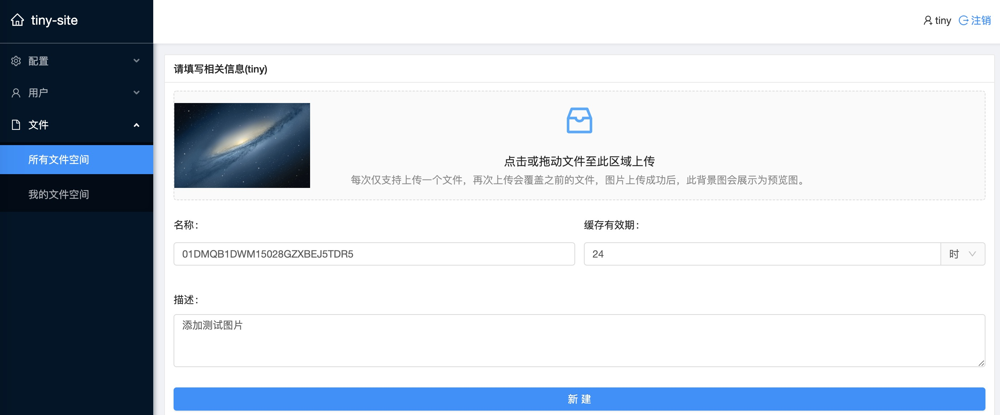
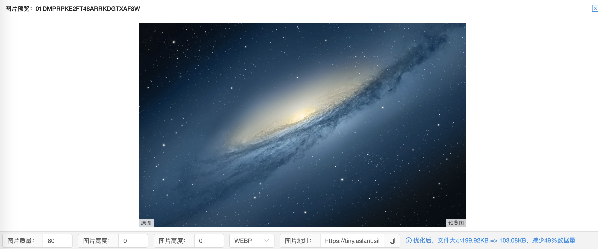

# tiny-site

在各终端分辨率以及支持图片格式各有差异的现实下，开发者一般都会采用折衷方案（偷懒）：选用最高的分辨率，最通用的图片格式。对于小分辨率终端，过高的分辨率，显示时做缩小展示，浪费了带宽。对于支持更优图片格式的终端，没有在质量与流量取得更优的平衡。

如果你有以下的烦恼：

- 客户端支持的图片格式不一，无法全部使用最优格式
- 需要使用固定高度，宽度100%的banner场景，应对不同的分辨率
- 不同的使用场景需要使用不同的质量图片
- 按需生成各类缩略图

使用`tiny-site`图片管理系统，可以简单的将原图片上传之后，依赖于[tiny](https://github.com/vicanso/tiny)，根据应用场景选择适合的图片参数，可生成`webp`, `png`与`jpeg`。通过文件名格式定义，以简便的形式支持自定义图片质量与尺寸，搭配CDN可根据应用需要生成各类不同的图片。


## 使用步骤

### 启动tiny压缩服务

```bash
docker run -d --restart=always \
  -p 7001:7001 \
  -p 7002:7002 \
  --name=tiny \
  vicanso/tiny
```

其中7001是提供HTTP服务，tiny-site主要使用7002的GRPC服务，因此7001可按需要设置是否可用。

### 初始化数据库

数据库使用`postgres`，可以使用docker启动相关的镜像并设置初始化数据库，其中账号密码可根据需要设置。

```bash
docker run \
  -p 5432:5432 \
  -e POSTGRES_USER=test \
  -e POSTGRES_PASSWORD=123456 \
  --restart=always \
  --name=postgres \
  -v /data:/var/lib/postgresql/data \
  -d postgres:alpine
```

### 创建db以及初始化权限

```bash
docker exec -it postgres sh

psql -U test

CREATE DATABASE "tiny" OWNER test;

GRANT ALL PRIVILEGES ON DATABASE "tiny" to test;
```


### 启动服务

```bash
docker run -d --restart=always \
  -p 7500:7001 \
  -e GO_ENV=production \
  -e PASS=pass \
  --name=tiny-site \
  vicanso/tiny-site
```

配置中密码为PASS，如果在env中有此字段，则会取ENV中配置的值，因此可以根据需要直接将密码设置至配置文件或者ENV中。需要注意，因为production.yml中的数据库配置在各自应用场景中不一致，建议`fork`项目再自己编译。或者增加自定义配置文件，`mount`至`/tiny-site/production.yml`，则启动脚本如下：

```yaml
# production 生产环境中使用的相关配置

# redis 配置 （填写相应密码与host)
redis: redis://:pass@redisHost:6379

# postgres 配置（填写相应密码与host)
postgres:
  user: test
  host: postgresHost
  password: pass

# tiny 配置tiny服务的IP（如果grpc的服务端口不是6002，也需要调整）
tiny:
  host: 192.168.0.171
  port: 7002

# 预览地址（根据实际使用配置预览地址，建议使用CDN，再设置CDN回源策略）
imagePreview:
  url: "http://localhost:7001/images/v1/preview/:file"
```

```bash
docker run -d --restart=always \
  -p 7500:7001 \
  -e GO_ENV=production \
  -v /opt/tiny/production.yml:/tiny-site/production.yml \
  --name=tiny-site \
  vicanso/tiny-site
```

## 使用建议

`tiny-site`目标是提供简单的方式定义图片参数，尽可能简单的使用较优的图片。为什么说是较优呢？因为此项目考虑的是能用性，主要是使用经常更新的图片应用场景，以及一图多终端使用的应用场景。由于各终端分辨率，支持图片类型各有差异，因此建议在终端中动态生成图片地址，根据展示的区域大小，支持的图片类型指定相应的图片参数。需要注意，由于`tiny`本身非专注与图片转换性能，因此建议使用CDN来缓存图片，提升性能。

### 浏览器中判断是否支持WEBP

```js
let isSupportWebp = false;
(function() {
  const images = {
    basic:
      "data:image/webp;base64,UklGRjIAAABXRUJQVlA4ICYAAACyAgCdASoCAAEALmk0mk0iIiIiIgBoSygABc6zbAAA/v56QAAAAA==",
    lossless:
      "data:image/webp;base64,UklGRh4AAABXRUJQVlA4TBEAAAAvAQAAAAfQ//73v/+BiOh/AAA="
  };
  const check = data =>
    new Promise((resolve, reject) => {
      const img = new Image();
      img.onload = resolve;
      img.onerror = reject;
      img.src = data;
    });
  Promise.all(map(images, check))
    .then(() => true)
    .catch(() => false)
    .then(result => {
      isSupportWebp = result;
    });
})();

export function supportWebp() {
  return isSupportWebp;
}
```

在浏览器中，使用上面的判断，对于支持`webp`格式的，则将图片后续替换为`.webp`，而不支持的则使用原后缀。`iOS`并没有支持`webp`格式，如果是在APP中，则可以自己扩展实现，`android`则系统原生支持，不需要做调整。

## 功能介绍

网站的主要功能比较简单，上传图片、图片列表、预览选择图片参数以及图片更新。





